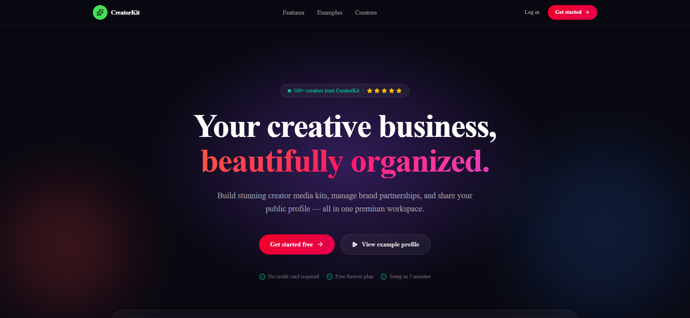
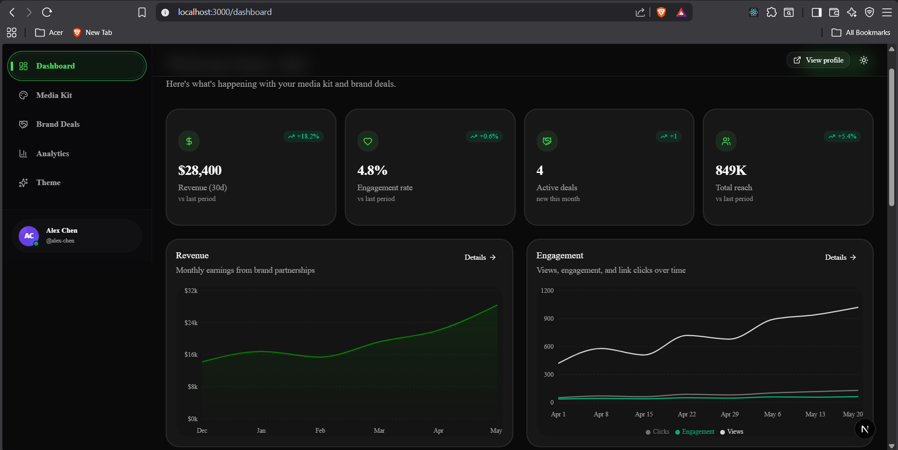
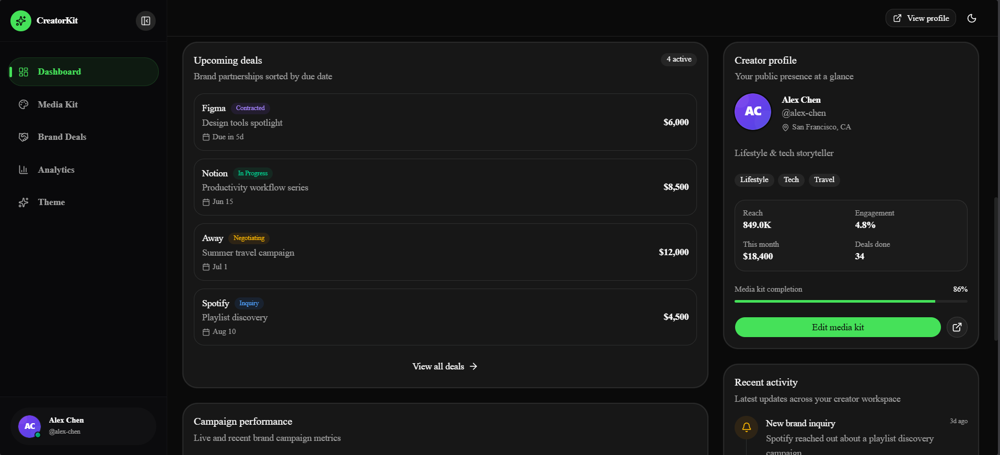
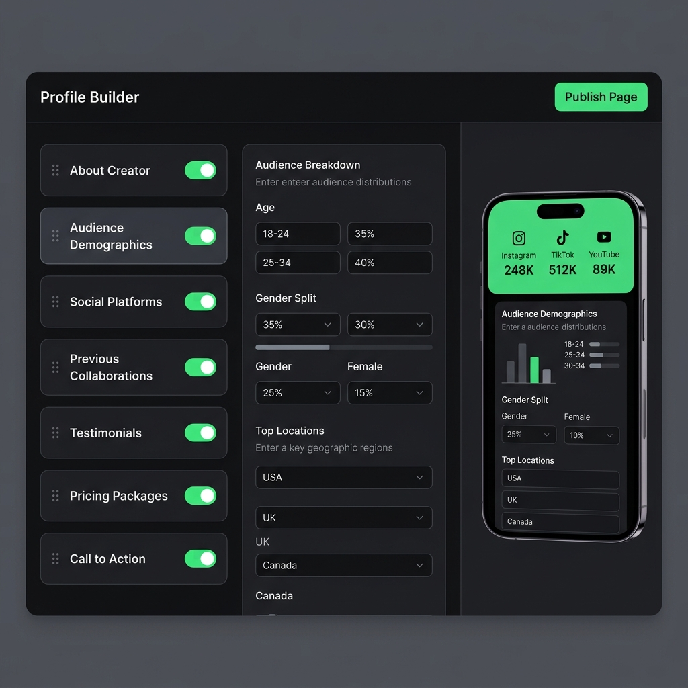
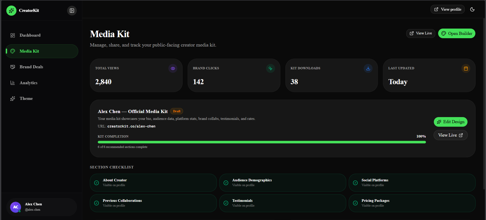
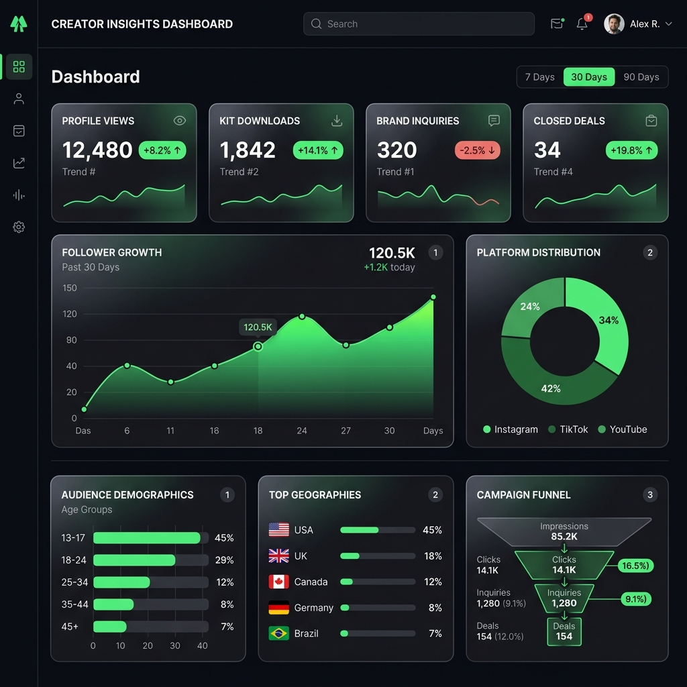
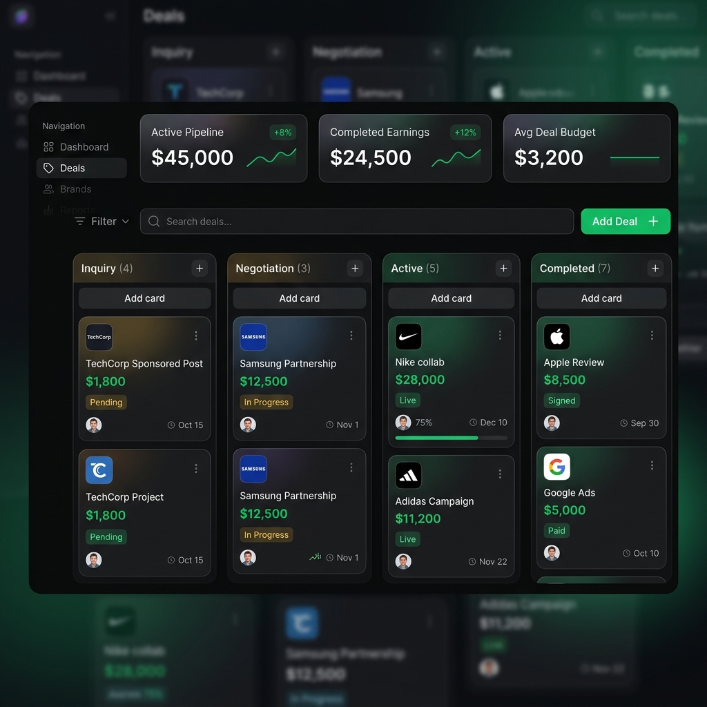
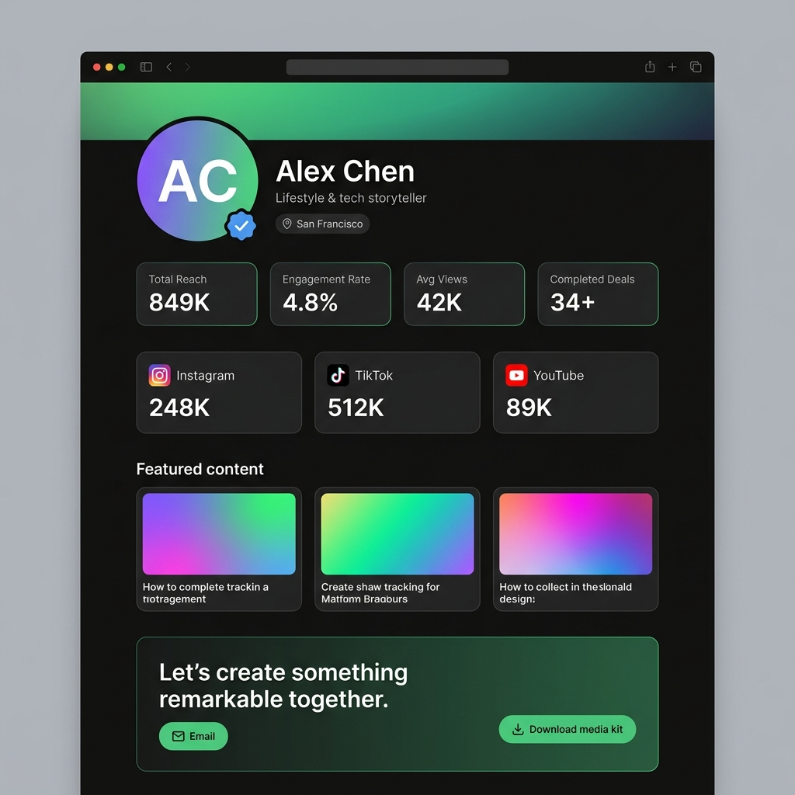

# CreatorKit — Media Kit Builder, Analytics & Brand Deal Platform

> A premium, production-ready creator workspace built with **Next.js 15 App Router**, **TypeScript**, **Tailwind CSS v4**, **Zustand**, **Framer Motion**, **dnd-kit**, and **Recharts**.

---

## Screenshots

### Creator Dashboard





### Media Kit Builder
<!--  -->


)

### Analytics & Insights


### Brand Deal Pipeline


### Public Creator Profile



---

## Key Product Pillars

### 1. Canvas-Style Media Kit Builder
- **Dynamic Canvas Layout**: Add, remove, toggle, reorder, and configure media kit sections with instant drag-and-drop interactivity powered by `@dnd-kit`.
- **Granular Block Editors**: Edit bio/avatar, audience demographics, social handles, pricing packages, testimonials, and past collaborations.
- **Device Mockup Preview**: Live mobile simulator side-by-side with the editor, plus full-screen responsive desktop preview toggle.
- **Theme Styling Engine**: Instantly switch between cohesive themes (`Link`, `Minimal`, `Studio`, `Bloom`) with live profile preview updates.

### 2. High-Fidelity Creator Analytics
- **Interactive Data Visualization**: Tailored chart wrappers built with Recharts — follower growth area chart, platform donut chart, demographics bar chart, and campaign funnel.
- **Comprehensive Metrics**: Follower growth trends, engagement rates, audience geography, platform distribution, and campaign conversion.
- **Date Range Filtering**: Switch between 7-day, 30-day, and 90-day views with smooth skeleton loading transitions.

### 3. Brand Deal Pipeline (Kanban)
- **Visual Deal Tracking**: Drag deals between `Inquiry → Negotiation → Active → Completed` via `@dnd-kit/core`.
- **Deal Details Drawer**: Review campaign terms, budgets, deadlines, a deliverables checklist, and a brand discussion message feed.
- **KPI Metrics**: Pipeline value, completed earnings, and average deal size at a glance.

### 4. Public Creator Profile
- **Hero Section** with banner, avatar, verified badge, niche tags, and location.
- **Analytics Highlights Bar**: Total reach, engagement rate, avg views, completed deals.
- **Social Platforms Row**: Platform cards with follower counts and external links.
- **Featured Content Gallery**: Top-performing content cards with views/engagement metrics.
- **Collaboration CTA**: Email inquiry button + media kit PDF download CTA.

### 5. Theme & Branding Customization
- Dark / Light / System mode toggle
- 4 curated theme presets with color swatch preview
- Custom accent color picker (hex + color wheel)
- Typography preset selector (Sans, Serif, Display)
- Corner radius selector (Sharp, Rounded, Pill)
- Avatar & Banner image upload with live preview

---

## 🛠️ Technology Stack

| Layer | Technology |
|---|---|
| Framework | Next.js 15 (App Router) + React 19 |
| Language | TypeScript |
| Styling | Tailwind CSS v4 + custom design tokens |
| State | Zustand with `persist` middleware |
| Animations | Framer Motion |
| Drag & Drop | `@dnd-kit/core` + `@dnd-kit/sortable` |
| Charts | Recharts |
| UI Primitives | Base UI + Radix UI via Shadcn |

---

## Project Architecture

Feature-isolated, domain-driven folder structure:

```text
my-app/
├── app/
│   ├── (dashboard)/          # Dashboard workspace routes
│   │   ├── dashboard/        # Overview page
│   │   ├── media-kit/        # Kit index + /builder
│   │   ├── deals/            # Brand deals kanban
│   │   ├── analytics/        # Analytics visualizations
│   │   └── settings/theme/   # Theme & branding settings
│   └── (public)/
│       └── [username]/       # Public creator profile page
├── components/
│   ├── layout/               # Sidebar, Header, Shell
│   ├── shared/               # Logo, PageHeader, EmptyState
│   └── ui/                   # Button, Card, Badge, Input…
├── features/                 # Feature-isolated domains
│   ├── analytics/            # Charts, KPIs, skeleton
│   ├── dashboard/            # Widgets, charts, hooks
│   ├── deals/                # Kanban, modals, store
│   ├── media-kit/            # Builder, blocks, store, preview
│   ├── profile/              # Public profile view
│   └── theme/                # Theme settings page
├── stores/                   # Global Zustand stores
├── data/mock/                # Static mock data
├── hooks/                    # Shared utility hooks
├── lib/                      # Utils, constants, animations
└── types/                    # Shared TypeScript types
```

---

## Technical Decisions

### 1. SSR Hydration Safety for Recharts
`ResponsiveContainer` reads `window` dimensions which don't exist on the server. We implement a `useMounted` hook that defers all chart renders until the client is fully interactive, eliminating hydration mismatch warnings.

### 2. Draft vs. Published State Isolation
The media kit builder maintains a **draft state** (live editor changes) completely separate from **published state** (what the public profile reads). Brands visiting `/alex-chen` always see the last published snapshot — never in-progress edits.

### 3. Unified Sidebar Layout
All dashboard pages share a single `h-screen overflow-hidden` shell, ensuring the sidebar is always viewport-constrained with a sticky bottom profile section — consistent across every route.

### 4. Responsive Kanban
- **Mobile/Tablet**: Horizontal scrolling strip (`285–320px` column width)
- **Desktop**: Auto-snap 4-column viewport grid

### 5. Accessibility (a11y)
- `aria-label`, `aria-expanded`, `aria-current` on all interactive elements
- Keyboard-navigable checklists and modals
- High-contrast focus rings for tab navigation

---

## Getting Started

### Prerequisites
- Node.js 18+
- npm or pnpm

### Installation

```bash
# 1. Install dependencies
npm install

# 2. Start development server
npm run dev
```

Open [http://localhost:3000](http://localhost:3000) in your browser.

```bash
# Build for production
npm run build

# Start production server
npm start
```

### Routes

| Route | Description |
|---|---|
| `/` | Marketing landing page |
| `/dashboard` | Creator workspace overview |
| `/media-kit` | Media kit index + stats |
| `/media-kit/builder` | Drag-and-drop kit builder |
| `/deals` | Brand deal kanban pipeline |
| `/analytics` | Analytics visualizations |
| `/settings/theme` | Theme & branding settings |
| `/alex-chen` | Example public creator profile |

